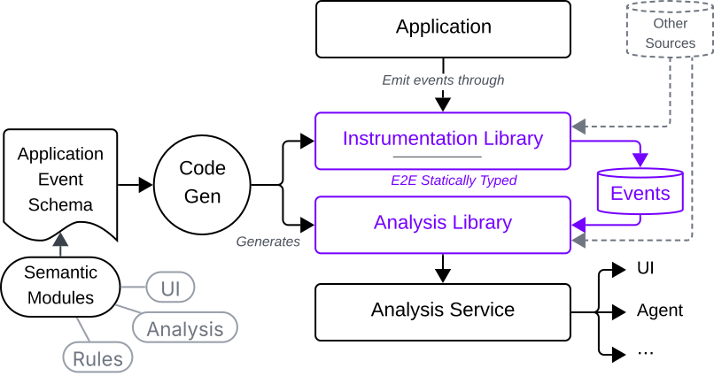

<!-- rumdl-disable MD033 MD041 -->

<p align="center">
  
</p>

<h1 align="center">Quent</h1>

<p align="center">
  <a href="https://github.com/rapidsai/quent/actions/workflows/rust.yml"></a>
  <a href="https://github.com/rapidsai/quent/actions/workflows/python.yml"></a>
  <a href="https://github.com/rapidsai/quent/actions/workflows/cpp.yml"></a>
  <a href="https://github.com/rapidsai/quent/actions/workflows/ui.yml"></a>
  <a href="LICENSE"></a>
</p>

## What is Quent?

Quent helps build dedicated performance analysis tools tailored to your
application. You and your agents first describe a _schema_ of _events_ with
_attributes_, which you use to instrument anything (called an _entity_) in your
application.

Quent then turns a _schema_ into a dedicated _instrumentation library_. This
instrumentation library not only has a type-safe API but also uses a statically
typed export path. It also generates an _analysis library_ that provides the
means to query stored events for various purposes. This includes not only the
means to look up events by attribute values but also the means to convert events
into something semantically rich, leveraging the rules imposed by _mods_.

<p align="center">

</p>

Mods (short for "semantic modules") are curated vertical slices of Quent’s
stack. Each mod can contribute constraints on schema elements (e.g. on events or
attributes), code generators, analysis componentss, visualizations, and agent
interfaces, among others.

By applying mods to an application-specific model, you and your coding agents
can easily provide the last bit of glue to mix and match mod components to
ultimately produce a dedicated performance analysis tool in which you can
quickly explore the dynamic behavior of your program.

For example, see the UI for the accelerated query engine domain, a primary use
case for Quent: 

## Why

Quent is built to address a growing complexity gap between complex modern
systems software and low-level profiling tools.

Highly dynamic software systems (take query engines, for example) have a lot
of "stuff" to do before the heavy computation actually starts inside
accelerators. All that "stuff" is complex, highly layered, and very
custom-tailored. This may include asynchronous execution engines, multi-layered
workload schedulers, out-of-core execution support, caching, and much more. All
this must not become a bottleneck to the raw computational and I/O performance
that accelerated systems nowadays provide. Looking at all this abstract
machinery with traditional profiling tools is, however, hard and time-consuming.

The goal is to reduce time to conclusion (TTC) for these applications by
allowing developers to start performance analysis from code they work with every
day, have full control over, and have already formed mental models for. This
helps narrow the analysis first in a familiar environment
before reaching for other excellent low-level profiling tools such as NVIDIA
Nsight Systems or Nsight Compute for deeper system-level or closer-to-hardware
analysis.

## Status

Quent is an experimental alpha-stage project and is changing quickly. Its schema
format, generated APIs, runtime, analysis components, and documentation may
change without compatibility guarantees for now. There are no releases yet;
breaking changes and bugs are currently expected. Use this at your own risk.

### Mods

Built-in mods include generally useful capabilities:

- `quent-fsm`: describes the potential sequences of events by modeling entities
  as finite-state machines.
  - Through this mod, the instrumentation library can be generated
    such that invalid transitions are already rejected at compile time, and/or
    an analysis library can validate whether FSM transition events followed the
    described topology.
- `quent-resource`: defines resources such as memories, channels, and processing
  elements, and how other entities can use them.
  - Through this mod, an analysis library can provide functionality
    that checks whether resources were saturated above some threshold for a
    certain duration, or it can generate data for a resource utilization
    timeline visualization.
- `quent-ref-target`: constrains references to other entities to be of a certain
  type.
- `quent-ref-scope`: allows forming hierarchies of event-emitting entities to,
  e.g., provide the canonical path of performance analysis exploration through
  all event data from a UI.

Mods can be self-authored and also provide components around
application- or domain-specific semantics. For example, applications that
capture dynamically defined computation paths via directed acyclic graphs can
describe a set of rules about how vertices and edges are declared and can
provide the means to analyze data-flow throughput over these edges. An analysis
component finds all associated events, and a UI component as part of the
mod can visually render the graph.

## Quick example

### Schema definition

Quent schemas describe the things, a.k.a. _entities_, that can emit _events_
with _attributes_, much like structured logs. Such a schema is said to capture
the "application event model" because, on the one hand, it just tells you what
events exist and, on the other hand, especially by leveraging mods, you sort of
model the potential behavior of things in your application.
Examples include an object whose lifecycle you want to track, a span around part
of a function, an asynchronous task, or a memory pool.

Quent's YAML-based source format is one way to capture your application event
model:

```yaml
quent: alpha # version of Quent's YAML-based DSL
model: Hello # name of the model

entities:
  App: # model the entire application process as an entity
    events:
      started: {} # that emits an event when it starts.
```

Mods can apply rulesets that add guarantees and more specialized
meaning to a schema. For example, an FSM ruleset defines the valid order in
which an entity's events can be emitted.

Quent's YAML-based source format provides built-in syntax for FSMs:

```yaml
quent: alpha
model: hello

fsms:
  App:
    states:
      started:
        initial: true
        to: [ended]
      ended:
        to: [exit]
        attributes:
          success: bool
```

### Generating an instrumentation library

After you finish modeling your application's events, a Cargo build script can
use `quent-yaml` to parse and validate a YAML source before
`quent-instrumentation-build` generates a typed Rust instrumentation library in
Cargo's `OUT_DIR`.

While Quent's core (generated) libraries are written in Rust, please see the
[cross-language integration section](#cross-language-integration) for how to
generate Python or C++ wrappers.

### Instrumenting an application

After generating the instrumentation library, include the generated source and
emit the schema's events:

```rust
mod hello {
    include!(concat!(env!("OUT_DIR"), "/hello.rs"));
}

let exporter = ExporterOptions::FileSystem(FileSystemExporterOptions::new(
    FileSystemFormat::Ndjson,
    "quent-data".into(),
));
let context = hello::HelloContext::try_new(Some(exporter))?;
let mut app = context.app_observer().handle();
app.started()?;
```

## Cross-language integration

Quent generates one canonical Rust instrumentation library. When needed,
additional code generators can provide C++ or Python bindings over that
implementation. This keeps event behavior and exporter integration consistent
across languages without maintaining separate language-specific SDKs.

- [C++ integration example](examples/cpp-integration/)
- [Python integration example](examples/python-integration/)

## More advanced examples

To give a more illustrative example of leveraging more mods, the
example below shows an application event model for a contrived distributed
application whose FSM-modeled entities use resources and tree-forming
references.

```yaml
quent: alpha
model: distributed_worker

entities:
  Cluster:
    events:
      started: {}

  Worker:
    events:
      started:
        attributes:
          cluster: { scope-ref: Cluster }
          host: string

  ThreadPool:
    events:
      created:
        attributes:
          worker: { scope-ref: Worker }

  Thread:
    resource: true
    events:
      registered:
        attributes:
          pool: { scope-ref: ThreadPool }

  Memory:
    resource:
      bytes: { kind: occupancy, known-bounds: true }
    events:
      registered:
        attributes:
          worker: { scope-ref: Worker }
          capacity: { sets-resource-bounds: true }

  Channel:
    resource:
      bytes: { kind: rate }
    events:
      connected:
        attributes:
          source: { scope-ref: Worker }
          target: { ref: Worker }

fsms:
  Task:
    states:
      allocating:
        initial: true
        attributes:
          worker: { scope-ref: Worker }
          memory: { uses: Memory }
        to: [computing]
      computing:
        attributes:
          memory: { uses: Memory }
          thread: { uses: Thread }
        to: [sending, exit]
      sending:
        attributes:
          channel: { uses: Channel }
        to: [exit]
```

Or a schema for (simplified) traditional telemetry signals:

```yaml
quent: alpha
model: telemetry

entities:
  Log:
    events:
      info:
        multi: true
        attributes:
          message: string
      warn:
        multi: true
        attributes:
          message: string
      error:
        multi: true
        attributes:
          message: string

  Metric:
    events:
      sample:
        multi: true
        attributes:
          value: f64

fsms:
  TraceSpan:
    states:
      open:
        initial: true
        to: [closed]
        attributes:
          name: string
      closed:
        to: [exit]
```

## More information

- [Complete schema-based instrumentation example](crates/instrumentation-build/example/)
- [Development guide](DEVELOPMENT.md)
- [Contributing guide](CONTRIBUTING.md)
- [Documentation book](docs/) — outdated and may not match current APIs.
